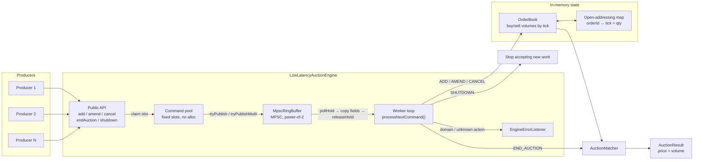
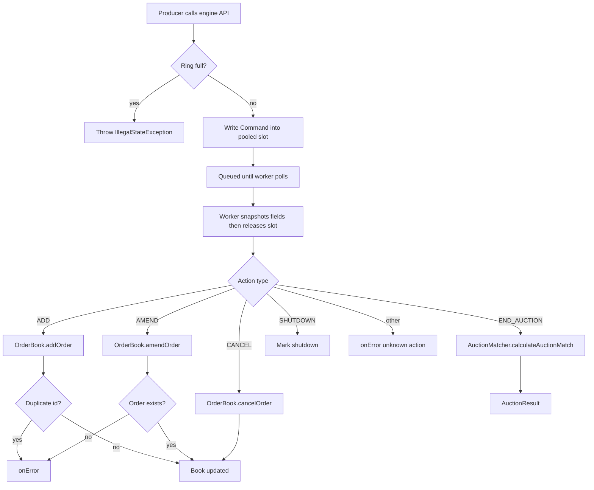

# Implementation notes

Scope: a **mid-level scale** in-memory call auction. The goal is a correct, low-allocation core that can ingest concurrent order actions and compute a clearing price. Exchange-grade features (persistence, networking, recovery, multi-symbol partitioning) are intentionally out of scope.

Error handling **is** implemented: domain failures do not kill the worker loop.

## Architecture

The engine is **in-process only**. Many producer threads enqueue commands; **one worker** (driven by the caller — no engine-owned thread) mutates the book and runs the call auction.



**Command path**



The worker is **caller-driven**: `Main` and the tests loop on `processNextCommand()`. Producers never touch the book.

| Component | Role |
|---|---|
| `LowLatencyAuctionEngine` | Command API, worker loop, error routing |
| `MpscRingBuffer` | Lock-free multi-producer / single-consumer inbound queue |
| `OrderBook` | Sparse tick segments, buy/sell volumes |
| `PrimitiveOpenAddressingMap` | Order id → packed `(tick, qty)` |
| `AuctionMatcher` | Cumulative volume scan + surplus tie-break |
| `EngineErrorListener` | Domain / unknown-action callbacks |
| `Main` | Demo producers + bounded retry for END/SHUTDOWN |

Commands: `ADD`, `AMEND`, `CANCEL`, `END_AUCTION`, `SHUTDOWN`.

## What is implemented

### Messaging
- Power-of-two ring size validation
- Pre-allocated `Command` pool (no per-message allocation)
- `tryPublish` / `tryPublishMulti`; poll returns `-1` when empty
- Backpressure: full queue throws `IllegalStateException`
- Worker spins with `Thread.onSpinWait()` when idle
- `Main` retries `END_AUCTION` / `SHUTDOWN` up to 1024 times

### Order book
- Add / amend / cancel
- Constructor rejects non-positive tick size or capacity
- Duplicate-id rejected
- Amend of unknown id rejected
- Cancel of unknown id is a no-op
- Non-positive / non-finite prices rejected on add/amend
- Non-positive quantities rejected on add/amend
- Quantities above `2,147,483,647` rejected on add/amend
- Amend/cancel with the wrong `isBuy` rejected; book unchanged
- Lazy segment growth for higher prices
- Prices stored as cents via `BigDecimal` (HALF_UP)

### Matching
- Call auction over `[minActiveTick, maxActiveTick]`
- **Maximum Volume Matching**: pick a price that maximises total matched quantity
- If several ticks share that volume, apply the surplus-pressure rules below (volume is unchanged)
- Empty / only-buys / only-sells / no-cross book → `(0.0, 0)`

## Tie-breaking

Call auction is **volume-first**, then **surplus pressure**, then **midpoint**. Logic lives in `AuctionMatcher.calculateAuctionMatch` and `resolveBestTick`. There is no time priority and no per-order allocation — only an aggregate price and matched volume.

### Maximum Volume Matching (primary rule)

Orders can rest on many price levels, so several prices can uncross the book. The engine uses the usual exchange definition:

> Select the auction price that results in the **highest total matched quantity**.

At price `P`:

| Side | What can trade |
|---|---|
| Buys | bids at `P` or **higher** (willing to pay at least `P`) |
| Sells | offers at `P` or **lower** (willing to sell at or below `P`) |
| Matched quantity | `min(those buys, those sells)` |

The scan from `minActiveTick` to `maxActiveTick` maintains cumulative sell (from below) and remaining buy (from above). Every tick with the same highest match is kept as `[minBestTick, maxBestTick]`. **Any price in that range satisfies Maximum Volume Matching.**

Tie-break never reduces `maxVolume`. It only chooses which of those equal-volume prices to print.

### How our extra steps relate to that rule

| Step | What we do | Required by max-volume? |
|---|---|---|
| 1. Max executable volume | keep all ticks with the highest match | **Yes — this is the spec** |
| 2. Surplus pressure | buy surplus > sell surplus → **upper** bound; sell surplus > buy surplus → **lower** bound | No — our choice among ties |
| 3. Midpoint | equal surplus → `(minBestTick + maxBestTick) / 2` | No — our choice among ties |

Surplus + midpoint is a volume-preserving way to pick a single print when the book is tied. It is **not** the full HKEX/ASX ladder (minimum surplus on *every* tick in the range, then last/reference price). Those can pick an inner tick when our rules pick a bound. If a later spec lists those steps, this matcher should be aligned to them.

### 1. Build the optimal price range

Walk every tick in `[minActiveTick, maxActiveTick]`:

- cumulative **sell** from the bottom of the range
- remaining **buy** from the top (start at total buy volume; subtract that tick’s buys after evaluating it)
- executable volume at tick `i` = `min(cumBuy, cumSell)`

Record:

| Value | Meaning |
|---|---|
| `maxVolume` | highest executable volume seen |
| `minBestTick` | lowest tick that still achieves `maxVolume` |
| `maxBestTick` | highest tick that still achieves `maxVolume` |

If `maxVolume == 0`, there is no trade → `(0.0, 0)`.  
If `minBestTick == maxBestTick`, that single tick is the clearing price (no tie).

### 2. Surplus at the two bounds

When the range is wider than one tick, compare unfilled interest at the edges:

| Bound | Surplus | What it measures |
|---|---|---|
| Lower (`minBestTick`) | `buySurplus = remainingBuy − maxVolume` | leftover bids if we print at the cheap end |
| Upper (`maxBestTick`) | `sellSurplus = cumSell − maxVolume` | leftover offers if we print at the expensive end |

### 3. Rules we apply

| Condition | Clearing tick | Why |
|---|---|---|
| One tick has unique max volume | that tick | no tie |
| `buySurplus > sellSurplus` | **upper bound** (`maxBestTick`) | excess demand pushes the price up |
| `sellSurplus > buySurplus` | **lower bound** (`minBestTick`) | excess supply pushes the price down |
| surpluses equal | **midpoint** `(minBestTick + maxBestTick) / 2` | integer tick; odd span rounds toward the **lower** tick |

### 4. Worked examples (`AuctionMatcherTest`)

| Book | Max volume | Tie range | Winner | Clearing price |
|---|---|---|---|---|
| Buy 100 @ 10.05, sell 80 @ 10.03 | 80 | 10.05 only | unique tick | **10.05** |
| Buy 100 @ 10.06; sells 20 @ 10.02, 10.03, 10.04 | 60 | up through 10.06 | buy surplus → upper | **10.06** |
| Buys 20 @ 10.03, 10.04, 10.05; sell 100 @ 10.02 | 60 | from 10.02 | sell surplus → lower | **10.02** |
| Buy 80 @ 10.06; sells 40 @ 10.02 and 40 @ 10.03 | 80 | 10.03–10.06 | equal surplus → midpoint | **10.04** |
| Only buys, only sells, or no cross | 0 | — | no trade | **0.00** / volume 0 |

Not used (deferred): last-trade / reference-price uncross, VWAP in the range, min-surplus on every tick in the range, time priority at the same tick.

### Hash map
- Open addressing, load factor ~0.5
- Reserved keys `0` and `Long.MIN_VALUE`
- Probe-chain-safe deletion (Knuth Algorithm R)
- Slot reuse after delete restores `size()`

### Error handling
Worker `try/catch` around each command. The loop keeps running.

| Condition | Behaviour |
|---|---|
| Duplicate order id | `onError(ACTION_ADD, id, IllegalArgumentException)` |
| Amend missing order | `onError(ACTION_AMEND, id, IllegalArgumentException)` |
| Wrong-side amend / cancel | `onError(ACTION_AMEND` / `ACTION_CANCEL, id, IllegalArgumentException)`; book unchanged |
| Unknown action type | `onError(type, id, IllegalArgumentException)` |
| Inbound queue full (ADD/AMEND/CANCEL/END/SHUTDOWN) | throw on submit (producer backpressure) |
| Null listener | no-op listener |
| Cancel missing order | ignored, not an error |
| `END_AUCTION` / `SHUTDOWN` full in `Main` | bounded spin retry, then fail |

### Tests

| Suite | What it covers |
|---|---|
| `LowLatencyAuctionEngineTest` | Power-of-two ring size; ADD/AMEND/CANCEL; unknown action; duplicate id; unknown amend; cancel no-op; **wrong-side amend/cancel**; **queue-full END_AUCTION/SHUTDOWN** |
| `AuctionMatcherTest` | Empty book; single best price; buy/sell surplus; midpoint; **only-buys, only-sells, no-cross → (0, 0)** |
| `OrderBookTest` | Aggregate volume; duplicate id; amend qty/price; cancel; high-price segments; **wrong-side amend/cancel rejected** |
| `PrimitiveOpenAddressingMapTest` | Put/get/remove; probe-chain after delete; slot reuse; reserved keys; **capacity-full, overwrite same id, remove missing** |
| `MpscRingBufferTest` | Non-power-of-two capacity; publish/poll; `tryPublishMulti` slot indexes; full backpressure |
| `MpscRingBufferConcurrencyTest` | SPSC FIFO; **3 producers + 1 consumer** (`tryPublish` and `tryPublishMulti`) |
| `LowLatencyAuctionEngineIntegrationTest` | 4 producers × 200 orders; **exact match 4000 @ 99.50** |
| `LowLatencyAuctionEngineStressTest` | **1M** concurrent ADDs; **exact match 5_000_000 @ 50.00** |
| `AuctionMatcherStressTest` | **1M** book ingest + match; **exact match 5_000_000 @ 50.00** |
| `LowLatencyAuctionEngineLatencyTest` | Per-command p99, match latency, end-to-end path (machine-dependent budgets) |

## Known gaps (deferred on purpose)

Mid-scale first. These are known, not accidental.

**Product / exchange**
- No REST/FIX/socket API — in-process only
- No persistence, snapshot, or crash recovery
- No replication / HA
- No multi-instrument sharding
- No trade tape / per-order allocation (aggregate price + volume only)
- No time priority at the same tick
- No market / iceberg / hidden orders
- No risk, fat-finger, or credit checks

**Order book correctness corners**
- `minActiveTick` / `maxActiveTick` never shrink after cancel (matcher may scan empty ticks)
- Quantity is limited to 31 bits (side occupies 1 bit of the map payload)
- Map does not resize; `maxOrders` is a hard cap
- No re-entry after `SHUTDOWN` except draining already-queued commands

**Performance (not HFT)**
- Worker is caller-driven (no pinned engine thread)
- `BigDecimal` on every price parse (not a pure primitive hot path)
- Matcher walks the full active tick range
- Ring wait strategy is spin-only
- No metrics beyond the error listener
- Latency tests use loose, machine-dependent budgets

## Scale target

Designed for **in-memory mid-scale** auctions on a single instrument / single worker.

**~1 million live orders is in scope** if `maxOrders` is set to at least `1_000_000` (the map does not resize).

| Resource | Size at 1M orders |
|---|---|
| Hash map (`maxOrders = 1_000_000`) | capacity 2²¹, ~32 MB keys+values |
| Inbound ring | 2k–32k slots (queue depth, not book size) |
| Tick segments | sparse; grows with price range, not order count |

Workload used for the numbers below: 500k buys @ 80.00, 500k sells @ 20.00, qty 10 → clearing **50.00**, matched volume **5_000_000**.

## Memory usage

The book is **pre-sized**. `maxOrders` fixes the hash map; it does not grow with live order count. Tick arrays grow only when a new price **segment** is first used. The inbound ring is queue depth, not book capacity.

### How it is laid out

| Structure | Formula | Notes |
|---|---|---|
| Hash map | `capacity = nextPow2(maxOrders × 2)` → two `long[]` (`idKeys`, `orderValues`) | `2 × capacity × 8` bytes. Load factor ~0.5 |
| Tick segment | 1024 ticks × 8 bytes × 2 sides | **16 KB** per allocated segment; lazy |
| Ring buffer | `ringSize × 8` payload + `ringSize × 8` sequences | power-of-two slots |
| Command pool | `ringSize` pre-allocated `Command` objects | ~50–70 B each; no per-message alloc |

Segment id = `tickIndex >>> 10`. Distinct prices in the same 10.24-wide tick band share one segment.

### Accounted size at 1 million orders

`maxOrders = 1_000_000` → map capacity **2,097,152**. Stress book uses only ticks 20.00 and 80.00 (two segments). Engine ring = 8192.

| Component | Calculation | Size |
|---|---|---|
| Map keys + values | 2 × 2,097,152 × 8 | **32.0 MB** |
| Tick segments (2 bands) | 2 × 16 KB | **0.03 MB** |
| Ring arrays | 8192 × 8 × 2 | **0.13 MB** |
| Command pool | 8192 × ~64 B | **~0.5 MB** |
| **Accounted total** | | **~32.7 MB** |

The map dominates. An empty engine constructed with `maxOrders = 1_000_000` already holds that 32 MB.

Wide price span (if every segment from 0.01 to 10,000.00 were touched): ~977 segments × 16 KB ≈ **15 MB** extra. That is the tick-range cost, not the 1M-order cost.

### Measured heap (this machine)

JDK 21, Gradle test worker (`-Xmx512m`). After `System.gc()`, `MemoryMXBean` heap used. Not a precise retainer size — includes JVM / test overhead.

| Run | Heap used | Committed | Runtime used |
|---|---|---|---|
| Matcher: 1M `addOrder` + match | **39.9 MB** | 140 MB | 40.7 MB |
| Engine: 4 producers, ring 8192, 1M ADD + match | **40.4 MB** | 147 MB | 41.4 MB |

~40 MB used vs ~33 MB accounted. The extra ~7 MB is object headers, segment pointer arrays, worker/producer threads, and the test harness.

### How to collect the numbers

`AuctionMatcherStressTest` and `LowLatencyAuctionEngineStressTest` print a heap line after the 1M load:

```bat
.\gradlew.bat test --tests org.macquarie.matcher.AuctionMatcherStressTest --tests org.macquarie.engine.LowLatencyAuctionEngineStressTest
```

Stdout is in `build/test-results/test/TEST-*.xml` (`heap used=… committed=…`). Re-run on the target host; committed heap is the JVM’s reservation, used is the live set after GC.

## Measured latency (1 million orders)

JDK 21, this machine. Not an SLO — rerun `LowLatencyAuctionEngineStressTest` / `AuctionMatcherStressTest` on the target host.

| Stage | What it measures | Time | Per order |
|---|---|---|---|
| Engine total | 4 producers → ring → worker ADD × 1M → match → shutdown | **422 ms** | **0.42 µs** |
| Book ingest | `OrderBook.addOrder` × 1M (no ring) | **169 ms** | **0.17 µs** |
| Match only | `AuctionMatcher.calculateAuctionMatch` on the 1M book | **0.74 ms** | — |

Almost all time is ingest. Match is sub-millisecond when the active tick range is small (20.00–80.00). A wide unused tick span is slower because the matcher walks `[minActiveTick, maxActiveTick]`.

Not designed for: tens of millions of orders, nanosecond HFT, multi-symbol colocated matching, or durable exchange operations.
